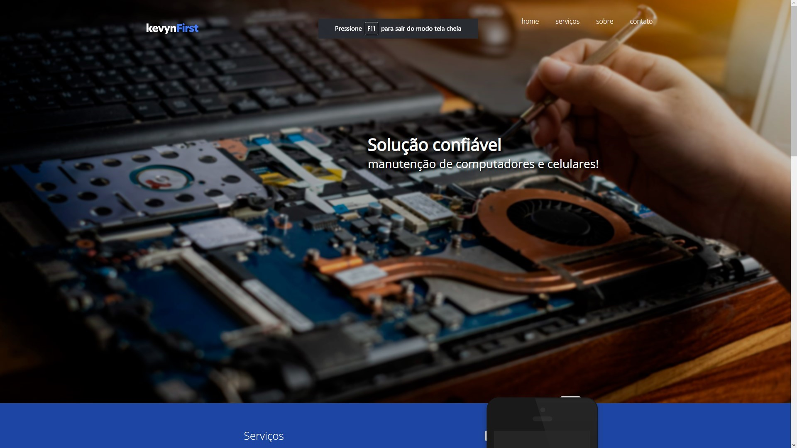

<h1 align="center">.:| Manutenção de hardware |:.</h1>

 

<h2 align="center">📖Descrição</h2>

Projeto simples descrevendo meus serviços de manutenção de computadores e celulares que faço como renda extra. Aqui eu utilizo HTML5, CSS3 e JavaScript, 100% responsivo.

<h2 align="center">🖥Preview</h2>
</img>

 

#### Veja o projeto funcionando <a href="https://kevynfirst.github.io/conserto-pc-celular">aqui</a>. 👈

 

<h2 align="center">🛠 Tecnologias</h2>

- [HTML5](https://html.com/)
- [CSS3](https://developer.mozilla.org/pt-BR/docs/Web/CSS)
- [JavaScript](https://www.javascript.com)

 

<h2 align="center">😉 Obrigado por visitar meu projeto</h2>

Você pode conferir outros projetos que desenvolvi aqui no meu GitHub, ou entrar em contato comigo pelos demais links.

